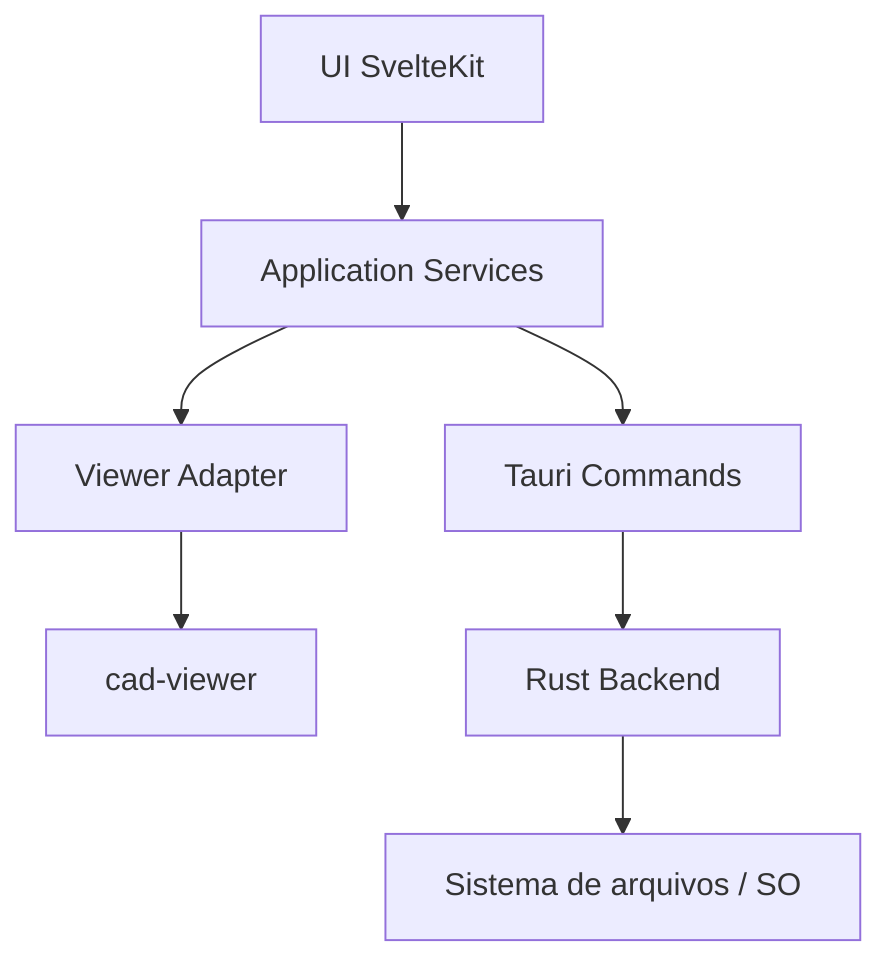
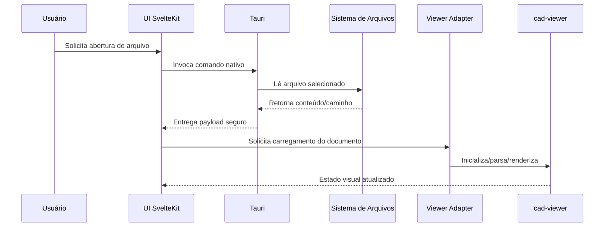

<!-- Caminho relativo: docs/architecture.md -->

# Arquitetura do NeoCAD

## Visão geral

NeoCAD será um aplicativo desktop construído com **SvelteKit + Tauri 2** que encapsula o `cad-viewer` em uma experiência de instalação e uso mais simples para Windows e Linux.

A arquitetura inicial foi desenhada para atender três objetivos ao mesmo tempo:

1. **entregar um wrapper desktop funcional rapidamente**;
2. **evitar fork prematuro do `cad-viewer`**;
3. **permitir evolução futura para plugins, UX desktop avançada e investigações BIM**.

## Decisões arquiteturais iniciais

### 1. Wrapper separado do upstream

A estratégia inicial é **não manter um fork pesado** do `cad-viewer` no MVP.

Em vez disso, NeoCAD deverá:

- consumir o upstream por versão fixa;
- isolar a integração em um módulo adaptador;
- manter customizações da UI e fluxo desktop do lado do NeoCAD;
- considerar fork apenas se surgirem bloqueios concretos de API, build ou manutenção.

### 1.1 Decisão prática da Fase 2

Na implementação inicial da Fase 2, a integração Svelte foi feita por meio de **`@mlightcad/cad-simple-viewer`**.

Essa decisão foi adotada porque:

- `@mlightcad/cad-viewer` é um componente Vue 3 pronto, com UI própria;
- NeoCAD precisa controlar sua interface em Svelte;
- `@mlightcad/cad-simple-viewer` oferece o núcleo framework-agnostic do ecossistema MLightCAD.

Assim, o wrapper continua alinhado ao upstream, mas usando a camada mais adequada para uma UI própria em SvelteKit.

### 2. Desktop first

O foco inicial é empacotar a aplicação para:

- **Windows**
- **Linux**

A interface continuará web-based internamente, mas distribuída em shell desktop via Tauri.

### 3. Edição básica já no MVP

O MVP não ficará restrito a visualização. A proposta é habilitar, de forma incremental e segura, as capacidades de edição básica já expostas pelo `cad-viewer`, sem assumir desde o início um escopo de CAD completo estilo AutoCAD.

### 4. BIM fora do núcleo do MVP

Funcionalidades BIM são desejáveis, mas entram como **trilha posterior e modular**. Isso evita acoplamento prematuro entre o núcleo DXF/DWG e um futuro suporte a IFC, metadados de elementos, validações e navegação semântica.

## Camadas propostas



### UI SvelteKit

Responsável por:

- layout principal;
- barras de ferramentas;
- painéis laterais;
- estados visuais;
- navegação e preferências;
- fluxos de abertura de arquivos e recentes.

Na continuidade da Fase 2, a UI deve evoluir para uma composição mais modular, com `src/routes/+page.svelte` atuando como controlador do workspace e componentes específicos em `src/lib/components/workspace/`. O plano detalhado dessa refatoração está em `docs/frontend-workspace-refactor.md`.

### Application Services

Camada de orquestração da aplicação, responsável por:

- ciclo de abertura e fechamento de documentos;
- sincronização entre UI e viewer;
- preferências de usuário;
- gestão de arquivos recentes;
- eventos de teclado, mouse e comandos;
- futura extensão por plugins.

### Viewer Adapter

Camada crítica para reduzir acoplamento com o `cad-viewer`.

Responsabilidades:

- encapsular inicialização do viewer;
- traduzir eventos e comandos do NeoCAD para a API do upstream;
- concentrar ajustes de integração;
- facilitar testes e troca de versão do upstream.

### Tauri Commands / Rust Backend

Responsáveis por:

- diálogo nativo de abertura/salvamento;
- acesso controlado ao sistema de arquivos;
- persistência local de configurações;
- integração com recursos nativos da plataforma;
- empacotamento e distribuição.

Na Fase 2 inicial, essa camada já utiliza plugins do Tauri para:

- abrir arquivos com `dialog`;
- ler bytes do arquivo selecionado com `fs`.

## Fluxo de abertura de arquivo



## Estrutura lógica proposta

```text
src/
├── lib/
│   ├── components/      # Componentes reutilizáveis de UI
│   │   └── workspace/   # Telas e painéis do workspace desktop
│   ├── features/        # Funcionalidades por domínio (viewer, files, settings)
│   ├── services/        # Orquestração de aplicação
│   ├── stores/          # Estado reativo
│   ├── styles/          # CSS global, tokens e estilos compartilhados
│   ├── viewer/          # Adaptador para cad-viewer
│   └── types/           # Tipos compartilhados
├── routes/              # Rotas SvelteKit
│   ├── +layout.svelte   # Layout global e carga de estilos centralizados
│   ├── +layout.ts
│   └── +page.svelte     # Controlador do workspace desktop
└── app.html

src-tauri/
├── src/
│   ├── commands/        # Comandos Tauri organizados por domínio
│   ├── state/           # Estado nativo persistente
│   └── main.rs
└── tauri.conf.json
```

## Regras de modularidade

- a UI não deve depender diretamente de detalhes internos do `cad-viewer`;
- integrações nativas devem passar por comandos Tauri bem definidos;
- lógica de produto deve ficar em serviços reutilizáveis, não espalhada em componentes;
- `src/routes/+page.svelte` deve concentrar orquestração e ciclo de vida, não markup excessivo nem CSS compartilhado;
- estilos visuais repetidos devem ser centralizados em `src/lib/styles`;
- suporte BIM futuro deve entrar como módulo separado, e não contaminar o núcleo do viewer DXF/DWG.

## Riscos identificados

### Dependência funcional do upstream

Como o MVP depende da maturidade do `cad-viewer`, algumas funcionalidades de edição básica podem exigir adaptação adicional ou contribuição upstream.

### Empacotamento multiplataforma

Windows e Linux exigem dependências e pipelines diferentes. Isso impacta CI, instalação local e troubleshooting.

### Escopo BIM

Adicionar BIM cedo demais pode aumentar radicalmente o escopo técnico e de produto. A mitigação é manter BIM explicitamente fora do núcleo do MVP.

## Critérios de sucesso da Fase 1 e Fase 2

### Fase 1

- projeto SvelteKit criado pelo CLI oficial;
- Tauri 2 inicializado com sucesso;
- build e execução local em pelo menos uma plataforma alvo.

### Fase 2

- núcleo do ecossistema `cad-viewer` incorporado ao wrapper via `@mlightcad/cad-simple-viewer`;
- abertura de arquivo local funcionando;
- renderização básica validada;
- base pronta para comandos iniciais de edição.

## Referências

- [`cad-viewer`](https://github.com/mlightcad/cad-viewer)
- [SvelteKit Documentation](https://kit.svelte.dev/docs)
- [Tauri 2 Documentation](https://v2.tauri.app/)
