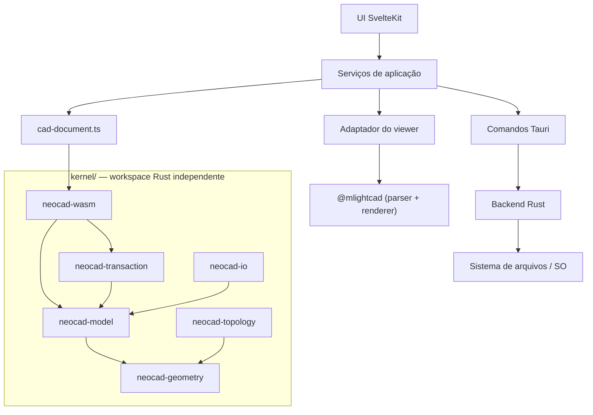

<!-- Caminho relativo: docs/architecture.md -->

# Arquitetura do NeoCAD

## Visão geral

NeoCAD é um aplicativo desktop construído com **SvelteKit + Tauri 2**, com
**kernel CAD próprio em Rust** compilado para WebAssembly. Os alvos são Windows e
Linux.

O projeto começou como wrapper do ecossistema `@mlightcad`. Essa fase entregou
uma aplicação que abre e exibe `DWG` e `DXF`, mas o teto funcional era o do
upstream: sem undo/redo, sem salvamento, sem controle sobre a evolução. O
[ADR 0003](./adr/0003-kernel-cad-proprio.md) decidiu construir kernel próprio, e
o [ADR 0002](./adr/0002-relicenciamento-para-gpl-3.md) relicenciou o projeto para
GPL-3.0, alinhando-o ao ecossistema copyleft de que ele depende.

A arquitetura atual persegue três objetivos:

1. **o kernel é a fonte de verdade** sobre o que existe no desenho;
2. **o upstream é substituível**, tratado como parser e renderer de transição;
3. **o kernel é reutilizável fora do NeoCAD**, o que impõe disciplina de
   biblioteca à sua API.

## Decisões arquiteturais vigentes

Cada uma tem ADR próprio; aqui fica o resumo e o efeito prático.

### 1. Kernel próprio, upstream rebaixado a parser e renderer

[ADR 0003](./adr/0003-kernel-cad-proprio.md). O kernel vive em `kernel/`, um
workspace Rust **independente** do de `src-tauri/`, e nenhuma de suas crates
conhece Tauri, Svelte ou DOM. Isso é o que permite reaproveitá-lo em outros
projetos.

Enquanto K5 (renderização própria) e K6 (leitura DWG) não chegam, o upstream
continua lendo o arquivo e desenhando. As duas representações convivem, e a
concordância entre elas é verificada em `e2e/kernel-document.e2e.ts`.

### 2. Fronteira única de integração

[ADR 0001](./adr/0001-catalogo-dinamico-e-paineis-sobre-data-model.md). Nem o
upstream nem o kernel aparecem em componentes Svelte ou rotas. A UI consome
contratos NeoCAD de `src/lib/types/cad.ts`; a tradução acontece uma vez, no
adaptador e nos serviços.

A regra vale para os dois lados: trocar o upstream, ou trocar a forma que o
kernel expõe, muda um arquivo e não a interface inteira.

### 3. Toda mutação do desenho é reversível

[ADR 0003](./adr/0003-kernel-cad-proprio.md), verificado pelo compilador. Alterar
entidades ou propriedades de camada só é possível por `Document::edit()`, que
registra a inversa de cada operação. As vias diretas são privadas à crate, e
quatro doctests `compile_fail` garantem que continuem assim.

Consequência: não existe alteração sem o que a desfaz.

### 4. Licenciamento copyleft, com o kernel isolado

[ADR 0002](./adr/0002-relicenciamento-para-gpl-3.md). O projeto é
`GPL-3.0-or-later` porque depende da LibreDWG e do `dxf-json`, ambos GPL-3.0.

As dependências copyleft ficam confinadas à crate `neocad-io`; as demais crates
do kernel permanecem livres delas, preservando a possibilidade de licenciar o
kernel de forma independente quando for extraído. Ver
[`THIRD-PARTY-LICENSES.md`](../THIRD-PARTY-LICENSES.md).

### 5. Desktop first, com interface headless prevista

O empacotamento tem Windows e Linux como alvos. O
[ADR 0004](./adr/0004-interface-para-agentes-de-ia.md) prevê, depois de K2, uma
interface headless (`neocad-cli` e um servidor MCP) que só é possível porque o
kernel não depende de navegador.

### 6. BIM e simulação numérica fora do núcleo

Continuam como trilhas posteriores e modulares. A simulação, em particular, ficou
formalmente dependente da topologia B-rep de K8 — sobre entidades 2D o
pré-processamento seria improviso.

## Camadas



### UI SvelteKit

Layout, menus, painéis, estados visuais, navegação e fluxos de abertura.
`src/routes/+page.svelte` atua como controlador do workspace, com componentes em
`src/lib/components/workspace/`.

Não conhece o kernel nem o upstream.

### Serviços de aplicação

Orquestração: ciclo de abertura de documentos, recentes, preferências, catálogo
de comandos, e a ponte com o kernel.

`src/lib/services/cad-document.ts` é a **única** porta de acesso ao kernel. Ele
carrega o WebAssembly por import dinâmico — o `.wasm` fica fora do bundle
inicial — e converte entre as formas do kernel e os contratos NeoCAD.

### Adaptador do viewer

`src/lib/viewer/neocad-viewer.ts` encapsula o upstream: inicialização do
`AcApDocManager`, eventos, abertura de documento, operações de viewport e
inventário de comandos.

Também extrai do documento aberto o retrato que alimenta o kernel. A extração
reconhece entidades pela **forma** dos objetos, e não pelo campo `type`, cujos
valores as declarações do upstream não especificam.

### Kernel CAD

Detalhado no [ADR 0003](./adr/0003-kernel-cad-proprio.md).

| Crate                | Responsabilidade                                         |
| -------------------- | -------------------------------------------------------- |
| `neocad-geometry`    | Primitivas, curvas e superfícies                         |
| `neocad-topology`    | B-rep — vértice, aresta, face, shell, sólido (K8)        |
| `neocad-model`       | Entidades, tabelas de símbolos, documento e journal      |
| `neocad-transaction` | Transações nomeadas e pilha de desfazer/refazer          |
| `neocad-io`          | Leitura e escrita de formatos; **única** com copyleft    |
| `neocad-wasm`        | Fachada `wasm-bindgen`; **única** que conhece o ambiente |

O modelo endereça entidades por identificador geracional: um identificador de
entidade removida resolve para `None` em vez de alcançar a entidade que ocupou o
slot depois. É o que impede que seleção, histórico e referências entre entidades
se corrompam em silêncio.

### Comandos Tauri e backend Rust

Diálogo nativo, acesso controlado ao sistema de arquivos, persistência local de
configuração e empacotamento. Hoje usa os plugins `dialog` e `fs`.

## Fluxo de abertura de arquivo

```mermaid
sequenceDiagram
  participant U as Usuário
  participant UI as UI SvelteKit
  participant T as Tauri
  participant A as Adaptador
  participant UP as "@mlightcad"
  participant K as Kernel (WASM)

  U->>UI: Solicita abertura
  UI->>T: Diálogo nativo e leitura do arquivo
  T-->>UI: Bytes do desenho
  UI->>A: openDocument(payload)
  A->>UP: Parseia e renderiza
  UP-->>UI: Documento ativo, canvas atualizado
  UI->>A: extractDocumentSnapshot()
  A-->>UI: Camadas, entidades e não suportadas
  UI->>K: load(snapshot)
  K-->>UI: Contagens; histórico zerado
```

A carga no kernel acontece **depois** de o upstream ativar o documento, e uma
falha ali não impede a exibição. Enquanto K6 não chega, quem lê o arquivo é o
upstream.

## Estrutura lógica

```text
kernel/                  # Workspace Rust independente (ADR 0003)
├── neocad-geometry/
├── neocad-topology/
├── neocad-model/
├── neocad-transaction/
├── neocad-io/
└── neocad-wasm/         # Fachada WebAssembly

src/
├── lib/
│   ├── components/      # Componentes de UI
│   │   └── workspace/   # Telas e painéis do workspace desktop
│   ├── config/          # Metadados e catálogo de apresentação
│   ├── kernel/pkg/      # Pacote WASM gerado no build (não versionado)
│   ├── services/        # Orquestração; fronteira com o kernel
│   ├── styles/          # Tokens, layout e estilos compartilhados
│   ├── types/           # Contratos NeoCAD
│   └── viewer/          # Adaptador do upstream
├── routes/
└── app.html

src-tauri/               # Shell desktop
scripts/                 # Release, workers, kernel, política de licenças
```

## Regras de modularidade

- componentes e rotas não importam `$lib/kernel` nem `@mlightcad/*`;
- nenhuma crate do kernel conhece Tauri, Svelte ou DOM, exceto `neocad-wasm`;
- nenhuma crate do kernel além de `neocad-io` recebe dependência copyleft;
- toda alteração do desenho passa pelo command stack transacional;
- artefatos derivados — pacote WASM, workers do upstream — não são versionados,
  e sim gerados no build;
- lógica de produto fica em serviços, não espalhada em componentes;
- estilos repetidos ficam em `src/lib/styles`;
- BIM e simulação entram como módulos separados.

## Riscos

### Escala do kernel próprio

É o risco dominante. As fases K1–K9 são trabalho de anos concentrado em um
mantenedor, e as fases 3D (K7–K9) são a parte mais difícil — a robustez de
operações booleanas sobre NURBS com tolerâncias reais é problema notoriamente
hostil. Mitigação: faseamento em que cada etapa entrega valor observável antes
de a seguinte começar.

### Duas representações vivas

Entre K1 e K5/K6, o modelo do kernel e o do upstream coexistem. Divergência entre
eles é a classe de bug mais provável do período, e apareceria tarde — painel
mostrando o que o canvas não mostra. Mitigação: verificação de contagem em E2E.

### Compatibilidade com arquivos reais

DXF e DWG carregam décadas de variações. O kernel modela hoje um conjunto mínimo
de entidades; o restante é contado como não suportado. Mitigação: a contagem é
visível ao usuário e vira a medida do que falta cobrir.

### Empacotamento multiplataforma

Windows e Linux exigem pipelines diferentes. Mitigação: `make dist-test` gera os
dois em uma execução, e a CI cobre ambos.

### Escopo de BIM e simulação

Antecipá-los multiplicaria custo de UX, integração nativa e suporte. Mitigação:
mantê-los fora do núcleo, com a simulação formalmente posterior a K8.

## Estado por fase

| Fase  | Entrega                                             | Estado     |
| ----- | --------------------------------------------------- | ---------- |
| 1     | Scaffold SvelteKit + Tauri 2                        | concluída  |
| 2     | Integração do viewer, workspace modular, abertura   | concluída  |
| K1    | Modelo de documento e transações com undo/redo      | concluída  |
| K2    | Leitura e escrita DXF nativas                       | próxima    |
| K3–K6 | Geometria 2D, restrições, renderização, leitura DWG | planejadas |
| K7–K9 | Geometria 3D, topologia B-rep, modelagem sólida     | planejadas |

O planejamento das frentes de interface e da trilha de simulação está em
[`cad-panels-commands-simulation-roadmap.md`](./cad-panels-commands-simulation-roadmap.md).

## Referências

- [ADRs do projeto](./adr/README.md)
- [`cad-viewer`](https://github.com/mlightcad/cad-viewer)
- [SvelteKit Documentation](https://kit.svelte.dev/docs)
- [Tauri 2 Documentation](https://v2.tauri.app/)
