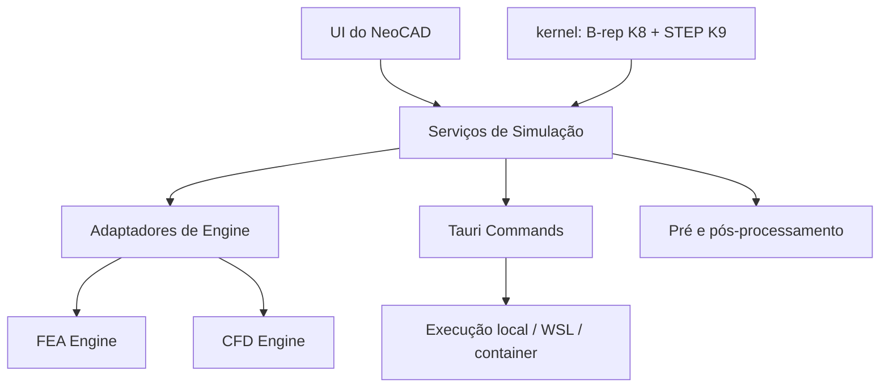

<!-- Caminho relativo: docs/cad-panels-commands-simulation-roadmap.md -->

# Roadmap de painéis, comandos CAD e simulação numérica

> **Realinhado ao [ADR 0003](./adr/0003-kernel-cad-proprio.md) em 2026-08-06.**
> A versão anterior deste documento pressupunha a arquitetura de wrapper, em que o
> teto funcional era o do `@mlightcad/cad-simple-viewer` e a diretriz central era
> "não prometer comandos que o upstream não executa". Essa premissa deixou de
> valer: o NeoCAD passa a construir kernel próprio, e o upstream é rebaixado a
> parser e renderer substituível. As frentes abaixo foram reordenadas em função
> disso.

## Objetivo

Consolidar o planejamento funcional do NeoCAD após a modularização do workspace
frontend e a decisão de kernel próprio.

O trabalho se organiza em duas trilhas paralelas de ritmo diferente:

1. **Trilha do kernel (K1–K9)** — profunda, lenta, define o teto do produto.
2. **Trilha de interface (Frentes 1–3)** — rasa, rápida, consome o que o kernel
   expõe e mantém o produto utilizável a cada passo.

A trilha de simulação numérica (Frente 4) permanece como investigação de longo
prazo, agora com uma dependência técnica clara: ela só se torna natural depois de
K7–K9, quando o kernel tiver geometria 3D e topologia próprias.

## Contexto atual

O NeoCAD já possui:

- workspace desktop modularizado em Svelte;
- menu superior no estilo desktop;
- canvas CAD com integração ao `@mlightcad/cad-simple-viewer`;
- barra de comandos do viewer upstream preservada no canvas;
- adaptador `NeoCadViewer` com `executeCommand(command)` e
  `listCommandDescriptors()`;
- catálogo de comandos derivado em runtime, exposto em `Ajuda > Comandos CAD`;
- suporte a abertura de `DWG` e `DXF`, recentes, drag-and-drop e ações iniciais de
  viewport;
- CI com verificação de tipos, lint, testes, build, Rust e política de licenças.

O que **não** existe, e que nenhuma quantidade de trabalho de interface resolve:
undo/redo, salvamento de arquivo, edição consistente e modelagem 3D. Esses são os
alvos da trilha do kernel.

## Princípios para esta etapa

- o **modelo de documento do NeoCAD** é a fonte de verdade a partir de K1; a UI
  não consulta o modelo do upstream para decidir o que existe no desenho;
- a fronteira do **ADR 0001** permanece: componentes Svelte e rotas não conhecem
  tipos do upstream nem do kernel, apenas contratos NeoCAD em `src/lib/types/`;
- nenhuma fase do kernel pode causar **regressão observável**: enquanto K_n não
  estiver pronta, a capacidade correspondente continua sendo servida pelo
  upstream;
- a interface só expõe o que **executa de fato** — a diretriz antiga continua
  valendo, mas agora a referência é o kernel, não o upstream;
- FEM/CFD permanece **módulo optativo e desacoplado**, nunca dependência
  obrigatória do fluxo base de CAD.

## Trilha do kernel

Detalhamento e diretrizes de conformidade no [ADR 0003](./adr/0003-kernel-cad-proprio.md).

| Fase   | Entrega                                      | Destrava na interface                        |
| ------ | -------------------------------------------- | -------------------------------------------- |
| **K1** | Modelo de documento + transações (undo/redo) | Frentes 1 e 3; menu `Editar`                 |
| **K2** | Leitura e escrita DXF nativas                | `Salvar`/`Exportar`; núcleo headless (A1)    |
| **K3** | Geometria 2D e operações de edição           | offset, trim/extend, fillet, snapping        |
| **K4** | Solver de restrições 2D                      | desenho paramétrico                          |
| **K5** | Renderização própria                         | grips, seleção fina, preview dinâmico        |
| **K6** | Leitura DWG (sobre LibreDWG, em `neocad-io`) | independência do upstream para abrir arquivo |
| **K7** | Geometria 3D (NURBS)                         | visualização e medição 3D                    |
| **K8** | Topologia B-rep                              | navegação por faces/arestas, propriedades 3D |
| **K9** | Modelagem sólida + STEP/IGES                 | modelagem 3D; pré-processamento de simulação |

A leitura nativa de DXF entrou em K2 pelo [ADR 0004](./adr/0004-interface-para-agentes-de-ia.md):
o ADR 0003 não a previa, porque assumia o upstream como parser — premissa que não
vale para um núcleo headless. É acréscimo de escopo, não supersessão.

K1 é o gargalo de tudo o que vem depois e está quebrada em micro-tickets em
[`docs/tickets/k1-modelo-documento-transacoes.md`](./tickets/k1-modelo-documento-transacoes.md).

## Frente 1 — Painéis de propriedades e camadas

### Objetivo

Painéis laterais para inspeção e controle do documento ativo: camadas,
propriedades da seleção e preparação para operações de edição.

### Reposicionamento

A versão anterior planejava ler camadas e propriedades diretamente do
`@mlightcad/data-model`, conforme o ADR 0001. **Isso continua válido apenas até
K1.** Depois de K1, os painéis leem o modelo do NeoCAD.

Consequência prática: **implementar os painéis em modo leitura antes de K1 é
aceitável e recomendável** — eles validam a ergonomia da UI e o contrato de
tipos —, mas as **ações de escrita** (ligar/desligar camada, editar propriedade)
devem esperar K1, porque sem transação não há undo, e uma edição sem undo é uma
regressão de usabilidade que depois precisa ser desfeita.

### Escopo antes de K1 (somente leitura)

- listar camadas do documento ativo com nome, cor, estado e metadados básicos;
- filtrar camadas por texto;
- estado vazio quando nada estiver selecionado;
- resumo do documento ativo quando não houver entidade selecionada;
- propriedades básicas da entidade selecionada.

### Escopo após K1 (escrita)

- ligar/desligar, congelar e bloquear camada, cada ação como transação
  reversível;
- edição de propriedade da entidade selecionada, idem;
- seleção múltipla com edição em lote.

### Estrutura

```text
src/lib/components/workspace/
├── LayersPanel.svelte
├── PropertiesPanel.svelte
└── WorkspaceSidebar.svelte

src/lib/services/
├── cad-layers.ts
└── cad-selection.ts
```

## Frente 2 — Menu `Ajuda` com referência de comandos CAD

**Status: concluída** (commit `254cb2f`). O catálogo é derivado em runtime do
command stack e exposto em `Ajuda > Comandos CAD`, conforme o ADR 0001.

### Ajuste necessário a partir de K1

A fonte do catálogo passa a ser **a união** dos comandos do kernel e dos comandos
ainda servidos pelo upstream, com a origem visível ao usuário durante a
transição. O `CadCommandCatalogItem` já prevê `status`; será preciso acrescentar
a noção de origem para que o catálogo continue sendo o retrato fiel do que
executa.

## Frente 3 — Comandos CAD básicos de criação e edição

### Objetivo

Sair do estado atual — barra de comandos do upstream e ações de viewport — para
um conjunto útil de comandos de desenho e edição acionáveis pela UI do NeoCAD.

### Reposicionamento

A versão anterior recomendava inventariar o que o upstream aceita e expor apenas
isso. O inventário foi feito e está em
[`docs/upstream-capabilities-spike.md`](./upstream-capabilities-spike.md): o
upstream tem ~31 comandos e **não tem** `UNDO/REDO, SCALE, MIRROR, ARRAY, OFFSET,
TRIM/EXTEND, BLOCK/INSERT`.

A conclusão mudou. Em vez de aceitar essa lista como teto, ela passa a ser a
**especificação do que o kernel precisa entregar**:

- `UNDO/REDO` → K1;
- `SCALE, MIRROR, ARRAY` → K1 (transformações sobre o modelo próprio);
- `OFFSET, TRIM/EXTEND, fillet/chamfer` → K3 (dependem de geometria);
- `BLOCK/INSERT` → K1 (tabela de blocos no modelo).

### Ordem recomendada

1. **Antes de K1:** nenhum comando de edição novo na UI. Expor comandos de
   edição sobre o modelo do upstream cria trabalho que será descartado, e sem
   undo é hostil ao usuário.
2. **Com K1:** menu `Editar` com `Desfazer`/`Refazer`, e os comandos de
   transformação que dependem apenas do modelo.
3. **Com K3:** comandos que dependem de geometria.
4. **Depois:** toolbars, atalhos de teclado e presença no catálogo de `Ajuda`.

### Estrutura

```text
src/lib/services/
├── cad-commands.ts
└── cad-command-catalog.ts

src/lib/components/workspace/
├── DrawToolbar.svelte
└── ModifyToolbar.svelte
```

### Critério de aceite

- o NeoCAD exibe apenas comandos comprovadamente funcionais;
- o catálogo em `Ajuda` reflete exatamente a realidade do app, incluindo a origem
  (kernel ou upstream) durante a transição;
- toda edição é reversível por `Desfazer`.

## Frente 4 — Trilha de FEM/CFD

### Posição arquitetural

Simulação numérica entra como **módulo separado de pré-processamento, execução e
pós-processamento**, e não como parte do núcleo CAD:

- o NeoCAD continua sendo o shell principal de CAD;
- FEM/CFD é trilha opcional;
- engines numéricas são **backends externos** acionados pelo desktop shell, não
  pelo frontend.

### Dependência do kernel

Esta é a mudança principal em relação à versão anterior do documento. O
pré-processamento de simulação — definir domínio, contorno, condições de
contorno, gerar malha — exige **geometria e topologia consultáveis**. Sobre um
modelo de entidades de desenho 2D isso é improvisação; sobre B-rep é natural.

Portanto, a Frente 4 fica formalmente **posterior a K8**, e o exportador STEP de
K9 passa a ser o formato de intercâmbio com malhadores e solvers externos.
Qualquer piloto anterior a isso deve ser tratado como experimento descartável, e
não como base de produto.

### Compatibilidade de licença

CalculiX, Elmer, Gmsh, OpenFOAM e SU2 são GPL ou compatíveis, o que é coerente
com o [ADR 0002](./adr/0002-relicenciamento-para-gpl-3.md). Como são acionados
como **processos externos**, e não ligados ao binário, a integração não impõe
restrição adicional além da já assumida.

### Avaliação das engines

#### FEA / FEM

- **CalculiX** — orientado a arquivos e execução por linha de comando, combina
  bem com uma arquitetura em que o NeoCAD orquestra casos locais. Candidato
  natural ao primeiro piloto.
- **Elmer FEM** — multiphysics, histórico relevante em pesquisa e engenharia,
  encaixe melhor que um solver script-first para integração progressiva.
- **FreeFEM++** — excelente para prototipação matemática e PDEs customizadas, mas
  o fluxo é orientado a script, com baixa aderência a um pipeline "desenho →
  malha → solver → resultados" para usuário generalista. Melhor como trilha
  paralela de pesquisa do que como engine de primeira integração.

#### CFD

- **SU2** — open-source, mais direto de integrar por CLI do que um ecossistema
  inteiro. Ponto de entrada mais controlável para uma primeira trilha CFD.
- **OpenFOAM** — ecossistema robusto e maduro, mas com integração e empacotamento
  pesados e operação mais natural em Linux; para alvo Windows tende a depender de
  WSL ou containers. Fica como backend avançado opcional, não como primeira
  entrega.

#### Malha

- **Gmsh** — malhador natural para consumir STEP produzido em K9.

### Arquitetura macro



### Etapas

- **S0 — Recorte de escopo.** Caso de uso prioritário, público-alvo, se a
  primeira entrega é FEA, CFD ou apenas pré-processamento, formatos intermediários
  de geometria e malha.
- **S1 — Pré-processamento.** Derivar do modelo B-rep as entidades de domínio e
  contorno; atribuir condições de contorno; exportar para malhador.
- **S2 — Piloto com engine única.** CalculiX ou Elmer para FEA; SU2 para CFD. Uma
  só, até o fim.
- **S3 — Execução externa via Tauri.** Montagem de diretório de caso, escrita de
  arquivos de entrada, execução de processo local, captura de logs, status e
  artefatos.
- **S4 — Pós-processamento.** Leitura de resultados, sobreposição de campos no
  app, sem depender da UI nativa de cada solver.

## Frente 5 — Interface para agentes de IA

Decisão e diretrizes de conformidade no
[ADR 0004](./adr/0004-interface-para-agentes-de-ia.md).

### Objetivo

Permitir que agentes de IA — Claude Code CLI e outros — e também scripts, CI e
humanos leiam e editem arquivos CAD através do NeoCAD, sem navegador e sem
interface gráfica.

### Por que só agora é possível

Enquanto o modelo de documento viveu dentro da WebView, não havia caminho
headless: ler um `DWG` exigia inicializar o viewer upstream com workers e canvas.
As crates do kernel são Rust puro, sem GUI — o núcleo headless é consequência
direta de K1 e K2, e esta frente é a primeira aplicação que ele habilita além da
interface gráfica.

Isso também significa que a frente **não compete** com o kernel por prioridade:
ela depende dele.

### Camadas

| Camada       | Papel                                              | Depende de   |
| ------------ | -------------------------------------------------- | ------------ |
| `neocad-cli` | Núcleo funcional; inspeção e edição por comando    | K1 + K2      |
| `neocad-mcp` | Fachada Model Context Protocol, sem lógica própria | `neocad-cli` |

O CLI vem primeiro por três razões: serve qualquer agente, inclusive os que não
falam MCP; é útil sozinho, para conversão em lote, scripts e regressão em CI; e
manter a lógica fora do servidor de protocolo evita que a capacidade fique presa
a um padrão que ainda está em evolução.

### Fases

- **A1 — Inspeção.** `neocad info`, `neocad layers`, `neocad entities`,
  `neocad convert`. Somente leitura, com `--format json`.
- **A2 — Edição.** Criar, alterar e remover entidades e camadas, cada operação
  como transação reversível do command stack de K1.
- **A3 — Servidor MCP.** Ferramentas tipadas sobre A1 e A2.

### Salvaguardas da edição automatizada

Um agente editando um desenho opera sobre trabalho de engenharia de outra pessoa,
sem supervisão contínua e sem o retorno visual que um operador humano tem.
Sobrescrever um arquivo de projeto por interpretação equivocada é perda real e
silenciosa. Por isso, condição para A2 existir:

- nunca gravar sobre o arquivo de entrada sem `--in-place` explícito;
- `--dry-run` em todo comando de edição, mostrando o que mudaria sem gravar;
- toda mutação pelo command stack transacional, portanto reversível e auditável;
- escrita determinística, para que a diferença entre duas versões seja legível.

### Ganho colateral

Um núcleo headless torna executáveis em CI os **testes de regressão sobre
arquivos CAD reais** — hoje impossíveis sem navegador, e a defesa mais importante
contra regressão de compatibilidade quando o kernel assumir o parsing.

## Ordem executiva recomendada

1. **K1** — modelo de documento e transações (em micro-tickets);
2. **Frente 1 em modo leitura**, em paralelo, validando a ergonomia dos painéis;
3. **Frente 3 com `Desfazer`/`Refazer`** e transformações sobre o modelo próprio;
4. **K2 — leitura e escrita DXF nativas**, que fecha o ciclo abrir → editar →
   salvar na GUI e, ao mesmo tempo, completa o núcleo headless;
5. **A1 — CLI de inspeção**, que valida a API do kernel sob um segundo consumidor
   e destrava regressão sobre arquivos reais em CI;
6. **K3/K4** e a Frente 1 em modo escrita;
7. **A2 — CLI de edição**, sobre as transações já exercitadas pela GUI;
8. **K5/K6**, reduzindo a dependência do upstream;
9. **A3 — servidor MCP**, fachada sobre A1 e A2;
10. **K7–K9**, o núcleo 3D;
11. **Frente 4**, sobre B-rep e STEP.

A1 aparece cedo de propósito: é barato depois de K2, e serve de prova de que a API
do kernel não embutiu suposições da interface gráfica. Descobrir isso com um CLI
de leitura custa pouco; descobrir em K7 custa caro.
