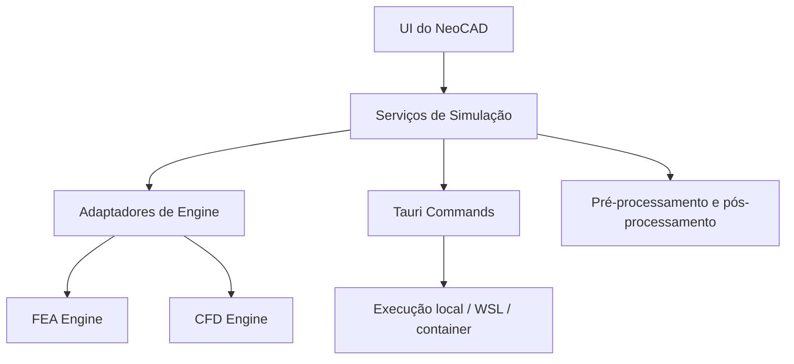

<!-- Caminho relativo: docs/cad-panels-commands-simulation-roadmap.md -->

# Roadmap de painéis, comandos CAD e simulação numérica

## Objetivo

Este documento consolida o planejamento da próxima etapa funcional do NeoCAD após a modularização do workspace frontend.

O foco agora é evoluir o app em quatro frentes complementares:

1. **painéis de propriedades e camadas**;
2. **menu `Ajuda` com referência dos comandos CAD implementados**;
3. **comandos CAD básicos de criação e edição**;
4. **trilha macro de funcionalidades FEM/CFD com engines open-source externas**.

## Contexto atual

No estado atual do projeto, o NeoCAD já possui:

- workspace desktop modularizado em Svelte;
- menu superior no estilo desktop;
- canvas CAD com integração ao `@mlightcad/cad-simple-viewer`;
- barra de comandos do viewer upstream preservada no canvas;
- adaptador `NeoCadViewer` com `executeCommand(command)`;
- suporte a abertura de `DWG` e `DXF`, recentes, drag-and-drop e ações iniciais de viewport.

Isso significa que a base para a próxima etapa **já não é mais a refatoração da UI**, mas sim a construção de funcionalidades sobre a arquitetura atual.

## Princípios para a próxima etapa

- manter o **NeoCAD como shell desktop própria**, sem perder o reaproveitamento do upstream;
- evitar prometer comandos CAD que o upstream ainda não executa de forma confiável;
- tratar o menu `Ajuda` como **catálogo vivo** do que realmente está disponível;
- separar claramente o núcleo CAD da trilha de simulação numérica;
- manter FEM/CFD como **módulo optativo e desacoplado**, nunca como dependência obrigatória do fluxo base de CAD.

## Frente 1 — Painéis de propriedades e camadas

### Objetivo

Adicionar painéis laterais para inspeção e controle do documento ativo, com foco inicial em:

- camadas;
- propriedades básicas do documento/seleção;
- preparação para operações futuras de edição.

### Escopo inicial recomendado

#### Painel de camadas

Capacidades mínimas:

- listar camadas do documento ativo;
- exibir nome, estado visível e metadados básicos quando disponíveis;
- filtrar ou localizar camadas por texto;
- permitir ligar/desligar camadas se a API do upstream já expuser isso com segurança.

#### Painel de propriedades

Capacidades mínimas:

- mostrar estado vazio quando nada estiver selecionado;
- mostrar resumo do documento ativo quando não houver entidade selecionada;
- mostrar propriedades básicas da entidade selecionada quando o upstream disponibilizar os dados.

### Dependências técnicas

Antes da implementação, vale confirmar no upstream/adaptador:

- como acessar a tabela de camadas do documento atual;
- como reagir a seleção de entidades;
- quais metadados de entidades estão disponíveis sem fork do upstream;
- se a alteração de visibilidade de camadas já existe como API estável.

### Estrutura sugerida

```text
src/lib/components/workspace/
├── LayersPanel.svelte
├── PropertiesPanel.svelte
└── WorkspaceSidebar.svelte

src/lib/services/
├── cad-layers.ts
└── cad-selection.ts
```

### Ordem recomendada

1. leitura de camadas;
2. painel de camadas em modo somente leitura;
3. painel de propriedades em modo somente leitura;
4. ações de camada quando a API do upstream estiver validada.

## Frente 2 — Menu `Ajuda` com referência de comandos CAD

### Objetivo

Transformar o menu `Ajuda` em um ponto de consulta rápida para o usuário sobre os comandos CAD realmente disponíveis no NeoCAD.

### Diretriz principal

A lista exibida em `Ajuda` deve ser **derivada de um catálogo interno de comandos**, e não de texto solto hardcoded na UI.

Isso evita divergência entre:

- o que o menu informa;
- o que o viewer aceita;
- o que a toolbar e atalhos realmente disparam.

### Conteúdo sugerido da referência

Para cada comando:

- nome amigável;
- comando textual enviado ao viewer;
- categoria;
- status: implementado, experimental, planejado;
- forma de acesso: barra de comandos, menu, botão, atalho;
- observações de uso.

### Estrutura sugerida

```text
src/lib/config/
└── cad-command-catalog.ts

src/lib/components/workspace/
├── HelpCommandsDialog.svelte
└── HelpCommandsList.svelte
```

### Contrato sugerido do catálogo

```ts
export interface CadCommandCatalogItem {
  id: string;
  label: string;
  command: string;
  category: 'navigation' | 'draw' | 'modify' | 'selection' | 'other';
  status: 'implemented' | 'experimental' | 'planned';
  access: Array<'menu' | 'toolbar' | 'command-bar' | 'shortcut'>;
  notes?: string;
}
```

### Evolução sugerida do menu `Ajuda`

- `Ajuda > Comandos CAD`;
- `Ajuda > Sobre o NeoCAD`.

### Entrega mínima

- catálogo interno versionado no código;
- diálogo/modal com lista filtrável;
- entrada no menu `Ajuda` apontando para esse catálogo.

## Frente 3 — Comandos CAD básicos de criação e edição

### Objetivo

Evoluir do estado atual, em que o app já mantém a barra de comandos do viewer e algumas ações de viewport, para um conjunto inicial de comandos úteis de desenho e edição.

## Estratégia recomendada

### Etapa 1 — Inventário real do upstream

Antes de construir botões e menu, mapear os comandos que o `cad-simple-viewer` já aceita de forma estável no fluxo atual.

Essa etapa deve responder:

- quais comandos textuais já funcionam hoje;
- quais exigem contexto adicional;
- quais ainda são apenas planejados no upstream;
- quais comandos podem ser expostos no NeoCAD sem gerar UX enganosa.

### Etapa 2 — Expor somente o que estiver validado

A UI do NeoCAD deve primeiro expor comandos que já foram validados pelo time, por exemplo:

- `line`;
- `circle`;
- `rectang` ou equivalente upstream;
- `erase`;
- comandos de viewport e seleção já disponíveis.

> Importante: os nomes acima devem ser tratados como candidatos iniciais. A nomenclatura final depende do inventário real do upstream e da forma como `executeCommand()` interage com ele.

### Etapa 3 — Adicionar acessos complementares

Depois da validação textual, os comandos podem ganhar:

- entrada no menu `Arquivo`/`Exibir`/futuro menu `Desenhar`;
- botões na toolbar contextual;
- atalhos de teclado;
- presença no catálogo do menu `Ajuda`.

### Categorias sugeridas de comandos

#### Navegação e viewport

- ajustar vista;
- zoom;
- pan;
- seleção.

#### Desenho

- linha;
- círculo;
- retângulo;
- polilinha.

#### Edição básica

- apagar;
- mover;
- copiar;
- rotacionar.

### Estrutura sugerida

```text
src/lib/services/
├── cad-commands.ts
└── cad-command-catalog.ts

src/lib/components/workspace/
├── DrawToolbar.svelte
└── ModifyToolbar.svelte
```

### Contrato sugerido para o serviço de comandos

```ts
export function executeCadCommand(commandId: string): void;
export function listImplementedCadCommands(): CadCommandCatalogItem[];
export function listPlannedCadCommands(): CadCommandCatalogItem[];
```

### Critério de aceite desta frente

- o NeoCAD exibe apenas comandos comprovadamente funcionais;
- o catálogo em `Ajuda` reflete exatamente a realidade do app;
- a barra de comandos do upstream continua sendo o ponto principal de entrada textual;
- a UI complementar do NeoCAD apenas facilita o acesso aos comandos já validados.

## Frente 4 — Trilha macro de FEM/CFD

## Posição arquitetural recomendada

Funcionalidades de simulação numérica devem entrar como **módulo separado de pré-processamento, execução e pós-processamento**, e não como parte do núcleo do viewer CAD.

Em termos práticos:

- o NeoCAD continua sendo o shell principal de CAD;
- FEM/CFD entra como trilha opcional;
- engines numéricas devem ser tratadas como **backends externos** acionados pelo desktop shell, não pelo frontend diretamente.

## Avaliação macro das engines citadas

### FreeFEM++

**Pontos fortes**:

- muito interessante para prototipação matemática e problemas de elementos finitos;
- flexível para problemas 2D e PDEs customizadas;
- excelente para investigação técnica e acadêmica.

**Limitações para o NeoCAD como produto desktop**:

- fluxo mais orientado a script do que a experiência de usuário final estilo CAD;
- menor aderência imediata a um pipeline “desenho → malha → solver → resultados” amigável para usuário generalista;
- pode ser melhor como backend experimental de pesquisa do que como engine principal de primeira integração.

### OpenFOAM

**Pontos fortes**:

- ecossistema robusto e amplamente conhecido para CFD;
- grande maturidade para casos avançados;
- forte relevância para usuários técnicos.

**Limitações para o NeoCAD neste estágio**:

- integração e empacotamento pesados;
- operação mais natural em Linux do que em Windows desktop puro;
- para alvo Windows, tende a depender de WSL, containers ou ambiente externo controlado;
- curva de UX alta para um MVP centrado em CAD desktop leve.

## Alternativas open-source mais viáveis para avaliação

### Para FEA / FEM

#### CalculiX

Boa opção para considerar porque:

- é relativamente conhecido no ecossistema open-source de análise estrutural;
- se adapta bem a fluxo orientado por arquivos e execução em linha de comando;
- combina melhor com uma arquitetura em que o NeoCAD orquestra casos locais.

#### Elmer FEM

Boa opção para considerar porque:

- é multiphysics;
- possui histórico relevante em pesquisa e engenharia;
- se encaixa melhor que um solver puramente script-first quando pensamos em integração progressiva via desktop shell.

### Para CFD

#### SU2

Boa opção para avaliação inicial porque:

- é open-source;
- tende a ser mais direto de integrar por CLI do que um ecossistema inteiro como OpenFOAM;
- pode ser um ponto de entrada mais controlável para uma primeira trilha CFD.

#### OpenFOAM como backend avançado opcional

Continua fazendo sentido, mas provavelmente como:

- backend avançado para Linux/WSL;
- modo experimental;
- integração posterior, não primeira entrega da trilha CFD.

## Arquitetura macro recomendada para simulação



## Proposta prática em etapas

### Etapa S0 — Pesquisa técnica e recorte de escopo

Definir:

- caso de uso prioritário de simulação;
- público-alvo inicial;
- se a primeira entrega é FEA, CFD ou apenas pré-processamento;
- formatos intermediários de geometria e malha.

### Etapa S1 — Pré-processamento e dados

Objetivo:

- derivar entidades CAD relevantes para contorno, domínio e condições de contorno;
- preparar exportação para malha e solver;
- sem ainda prometer solver embutido no produto final.

### Etapa S2 — Prova de conceito com engine única

Recomendação:

- escolher **uma única engine** para o primeiro piloto.

Sugestão prática:

- FEA inicial: **CalculiX** ou **Elmer** como caminho mais produto-orientado;
- FreeFEM++ fica como trilha paralela de pesquisa matemática, se desejado;
- CFD inicial: **SU2** para piloto mais controlado;
- OpenFOAM fica como meta posterior ou modo avançado Linux/WSL.

### Etapa S3 — Execução externa via Tauri

Implementar:

- comandos Tauri para montar diretórios de caso;
- escrita de arquivos de entrada;
- execução de solver externo por processo local;
- captura de logs, status e artefatos de saída.

### Etapa S4 — Pós-processamento no NeoCAD

Objetivo:

- ler resultados simplificados;
- sobrepor campos e resultados no app;
- evitar depender de UI nativa de cada solver.

## Recomendação executiva

Se o objetivo é manter o roadmap viável e incremental, a ordem recomendada é:

1. **painéis de camadas e propriedades**;
2. **catálogo de comandos em `Ajuda`**;
3. **comandos CAD básicos realmente validados**;
4. **estudo de FEA/CFD como módulo separado**;
5. **piloto com uma engine única antes de expandir para outras**.

## Próximos passos sugeridos

### Curto prazo

- criar catálogo interno de comandos CAD;
- evoluir o menu `Ajuda` para exibir os comandos implementados;
- validar tecnicamente o inventário real de comandos aceitos pelo upstream;
- iniciar painéis laterais de camadas e propriedades em modo leitura.

### Médio prazo

- expor comandos básicos de desenho pela UI;
- adicionar atalhos e toolbar contextual;
- persistir preferências dos painéis e da shell desktop.

### Longo prazo

- abrir uma trilha dedicada de simulação com documento próprio;
- decidir primeira engine de FEA/CFD a ser pilotada;
- integrar execução externa via Tauri/Rust.
